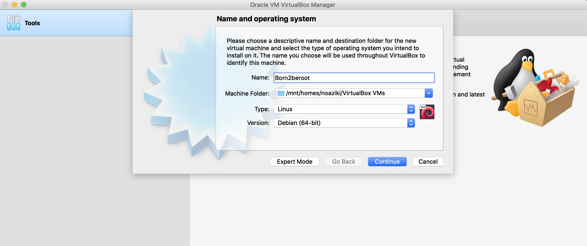
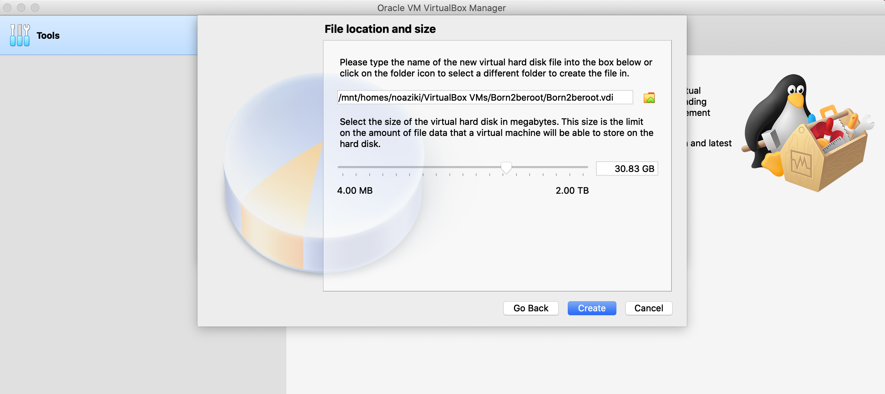
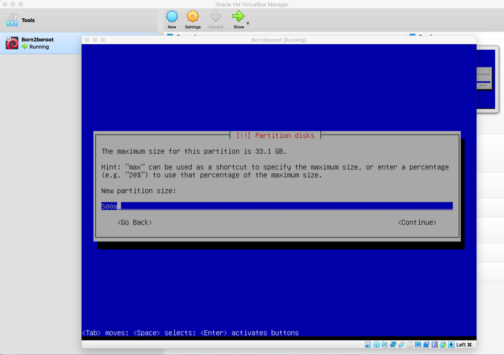

# Born2beroot

## Description
**Born2beroot** is your essential companion to mastering Linux system administration, designed to guide beginners and aspiring professionals into the world of root access and system management. This resource simplifies the complexities of Linux, offering clear, practical steps to help users build confidence and expertise.

From foundational concepts like file systems, permissions, and processes to advanced topics such as security, networking, and automation, Born to be Root equips you with the tools and knowledge to excel in system administration. Its hands-on tutorials and real-world examples provide a solid framework for tackling diverse challenges, ensuring you gain both understanding and practical skills.

By adopting the mindset of the root user — the ultimate superuser — you’re encouraged to explore, experiment, and take full control of your Linux environment. This guide empowers you to unlock the system’s full potential, transforming you into a confident and capable administrator.

Whether setting up servers, troubleshooting, or optimizing performance, **Born2beroot** is your trusted guide to navigating the dynamic world of Linux with ease and proficiency.

*For more check the [subject](subject.pdf)*

`Before starting, it's important to understand that each action in every step serves a specific purpose. You should know why it's being done and how it contributes to the overall process. A solid grasp of the technical context is crucial to fully comprehend the procedure.`

## Step 1: Check for VirtualBox

To get started, ensure you have **VirtualBox** installed. If not, you can download it from [this link](https://www.virtualbox.org/). **VirtualBox** is essential for setting up the operating system we’ll be working with.

At 1337, **VirtualBox** is already available on the macOS devices, so you likely won’t need to install it. Double-check whether it’s already installed on your machine before proceeding.

### Some things you need to learn

- **VirtualBox**: Understand what VirtualBox is and how it works as a virtualization tool.
- **Virtualization**: Learn the concept of virtualization and its role in creating virtual environments.
- **Operating Systems**: Familiarize yourself with what operating systems are and their importance in managing computer hardware and software.
- **Hypervisor**: Discover the role of a hypervisor and how it enables virtualization by managing virtual machines.

## Step 2: Selecting the Operating System

### Debian vs Rocky Linux

When considering the operating system for the "**Born2beroot**" project, **Debian** stands out as the top recommendation. Here’s why:

1. **Stability and Reliability**: Debian is renowned for its robust stability, making it an ideal choice for server environments. With its established release cycle and thorough documentation, it offers a smooth experience for both beginners and advanced users alike.

2. **Extensive Community Support**: Debian is supported by a vibrant and engaged community, with a wealth of online resources to assist you. This active support network is especially valuable if you’re just starting out in system administration.

3. **Ideal for System Administration**: As specifically recommended for newcomers to system administration, Debian’s user-friendly package management (apt) and comprehensive documentation simplify the learning process. It’s a great choice for implementing essential tasks required by the project.

4. **Robust Security**: Debian comes with solid security features, including SELinux, which should be enabled at startup and configured as per the project requirements. AppArmor is also necessary to run at startup, adding another layer of security to the system.

5. **Project Compatibility**: Debian’s capabilities align perfectly with the project’s needs. From setting up encrypted partitions with LVM to implementing a strict password policy, configuring sudo, managing SSH access, and setting up a firewall with UFW, Debian supports all these requirements.

6. **Bonus Features**: Should you opt for the bonus section of the project, Debian provides a stable environment for additional services, like setting up WordPress or any custom service you prefer.

7. **Current Version**: The most recent stable version of Debian, as of this guide’s writing, is Debian 12.5. You can download the image from [this link](https://www.debian.org/download).

In conclusion, Debian offers a dependable, secure, and well-documented platform that fits perfectly with the project’s needs. It’s an excellent choice for gaining hands-on experience in system administration while ensuring your environment is well-supported and aligned with the project’s goals.

## Step 3: Creating a New Virtual Machine in Oracle VirtualBox

1. Launch Oracle **VirtualBox**.

2. Select the "**New**" button at the top of the window.

3. In the **name** field, enter "Born2beroot" and change the **version** to Debian (64-bit).

4. After pressing **continue** button, the **memory size** should automatically be set to **1024 MB** (1 GB), which is recommended. If it doesn’t appear as **1024 MB**, manually adjust it to that value.

5. After pressing **continue** button, When prompted with three options, select the second one: **Create a virtual hard disk now**.
   

6. After pressing **continue** button, In the **Hard disk file type** options, choose the first option: **VDI (VirtualBox Disk Image)**.
   

7. After pressing **continue** button, In the **Storage on physical hard disk** options, choose the first option: **Dynamically allocated**.
   

8.  After pressing **continue** button, set the size of the virtual hard disk to **30 GB** if you're going to work on the **bonus part** of the project (You cannot select 30 GB exactly, but make sure the size is set to at least 30 GB). If you're only going to complete the **mandatory part**, choose **8 GB**. If you choose the **mandatory** option, you won't need the extra steps required for the **bonus part** later on. Since you're focusing on the **bonus**, you'll proceed with the 30 GB size.

9.  After pressing **continue** or **finished** button, you should see your new **Virtual Machine** created. To move on to the next step, go to **Settings** to start mounting an **ISO file**.

10. In **Settings**, click on the **Storage** tab, then select the **Empty** option under **Storage Devices**.

## Step 4: Mount the ISO File and Start the Virtual Machine

1. Once you’ve clicked on **Empty**, you should see a small disk icon similar to the one in the **screenshot below** next to the **optical drive**. Click on it.

2. Choose **debian-12.8.0-amd64-netinst.iso** from the list if it appears. If it doesn't show up, click on the **Choose a disk file** button and select the **debian-12.8.0-amd64-netinst.iso** file from the folder where you downloaded **Debian**.

3. Now, start the machine by clicking the **Start** button, so you can continue with the next step to install **Debian**.

## Step 5: Installing Debian Operating System

### Configuring the Language, Time Zone, and Keyboard Layout

1. The screen will appear as shown below. For a better viewing experience, right-click with your mouse, select the **Virtual Screen 1** option, and scale it to **200%**. After that, choose the **Install** option, as we will proceed without using a graphical interface.

2. Next, you’ll be prompted to select a language. I’m choosing English.

3. Enter your Country, Territory, or Area. Since I’m in Morocco 🇲🇦 I’ll select Other.

4. Choose your continent or region. In my case, it's Morocco 🇲🇦. I will start by selecting Africa.

5. Choose your Country, Territory, or Area. Since I’m Moroccan, I’ll select Morocco 🇲🇦.

6. For configuring locales, I’ll choose United States.

7. In keyboard configuration, Select American English to ensure the keys are correctly mapped; otherwise, the keyboard layout may not function as expected.

8. Once this steps is completed, you should see a window similar to the one below.

### Configuring the Network

1. The system will first ask for the **hostname**. As per the instructions, you should enter your **intra name** followed by **42**. In my case, it’s **noaziki42**.

2. For domain name, We'll leave this section blank, as the instructions do not specify any requirements for a domain name.

3. You’ll be prompted to enter a password for the system administrator account. It's important to write it down or take a photo for reference, as you will need it later. If you want to confirm that you've entered the password correctly, tab until you reach the **Show Password in Clear** option. Press the space bar, and the password will be displayed.

4. Now, you'll be asked to re-enter the password to confirm it. Make sure it matches the one you entered previously.

5. To avoid using the root account for non-administrative tasks, you'll be prompted to create a normal user account. I’ll enter my full name, **Nouhaila Aziki**, as the full name for the new user.

6. Now, you’ll be asked to provide a nickname or username for the non-root user. I’ll proceed with my intra username, **noaziki**, as the username for the new user.

7. You’ll need to choose a password for the non-root user. I’m proceeding with a new one, but if you think you might forget it, it's better to use the same password as the one for the Root User 😊.

8. You’ll need to confirm the password for the non-root user. As I showed when setting the root password, you can use the arrows to navigate to the **Show Password** option and press the space bar to display it, ensuring it’s correct.

### Setting Up the Partitions

Partitioning is crucial for organizing disk space on your server. It divides the disk into separate sections, each serving a specific purpose.

1. **Use Entire Disk and Set Up Encrypted LVM**: This option selects guided partitioning, which will automatically partition the disk and set up encrypted Logical Volume Manager (LVM). This option is required since the project specifies the use of encrypted partitions.

**BUT... ⚠️❗️** If you're aiming to complete the **bonus part** of the project, you'll need to click Manual and proceed with custom partitioning. This part is a reminder for those who want to do the bonus work. If you want to follow the default process, you can skip this step and continue with the guided option.

I will proceed with what’s required for the bonus part, but you can choose to skip it and go straight to the guided partitioning.

2. In this section, you’ll see a general description of your partitions and mount points. Since we haven’t created any partitions yet, we need to create a  new partition table. To do this, choose the device where you want to create the partitions. In my case, I’ll select the only available device: SCSI2 (0, 0, 0) (sda) - 33.1 GB ATA VBOX HARDDISK.

Don’t be confused if you see SCSI3 instead, as the SCSI controller number is assigned automatically by VirtualBox and may vary between installations or configurations. This number is just a virtual representation of the disk controller used by the virtual machine. As long as you choose the correct disk (sda) with the correct capacity (33.1 GB ATA VBOX HARDDISK), you should be good to go.

3. Click **Yes** to confirm the device selection.

4. After completing the previous step, you’ll see an empty partition table. To configure it, select the **FREE SPACE** in order to create the partitions.

5. Create a new partition.

6. Following the image provided in the subject, we will create the partitions one by one (this image from the bonus part).

7. As indicated in the subject, the size of the first partition should be **500 megabytes**.

8. I will briefly explain the different types of sections:

`Primary Partition: This is the only type of partition that can hold an operating system. A hard drive can have up to four primary partitions, or three primary partitions and one extended partition.`

`Extended Partition: Designed to overcome the limit of four primary partitions on a single disk, only one extended partition can exist per disk. It serves as a container for logical partitions.`

`Logical Partition: This partition exists within an extended partition and is formatted with a specific file system, like ext4. Once formatted, it is recognized by the operating system as a separate drive. While you can have up to 23 logical partitions in theory, Linux limits this to 15 logical partitions for practical use, which is more than enough for the scope of this project.`

For this step, we will choose Primary because it will be the partition where the Operating System will be installed.

9. We will select **Beginning** because we want the new partition to be created at the start of the available space on the disk.

10. The following screenshot displays the partition details. We will modify the mount point according to the specifications provided in the project instructions.

11. We will choose **/boot** as the mount point for our partition, as specified in the project instructions.

12. We have finished configuring the current partition.

13. Once we have completed the previous step, the partition should appear. Next, we need to create a logical partition using all the remaining available disk space. This partition will have no mount point and will be encrypted. To do this, we select the free space where we want to create the logical partition.

14. Create a new partition

15. We will follow the example provided in the subject for creating the logical partition.

16. We will select max for this partition to utilize all the remaining available disk space.

17. Since we need to create the LVM, we must select Logical for this partition type.

18. For this partition, we will not assign a mount point, as it is meant to be encrypted and used for LVM (Logical Volume Management).

19. In the context of virtual machines (VMs) and disk management, logical partitions are typically not mounted directly because they are part of a larger virtual disk image or disk file. Instead, they are used as components of LVM (Logical Volume Management), where they are combined into logical volumes that are then mounted for use by the system.

20. Now that we have selected Logical for the partition type and left it without a mount point, we can finish the partitioning process by confirming and applying the changes. Once done, the logical partition will be created, and we'll proceed to the next steps in the setup process.

21. Let's configure the encrypted volumes now

11. 
