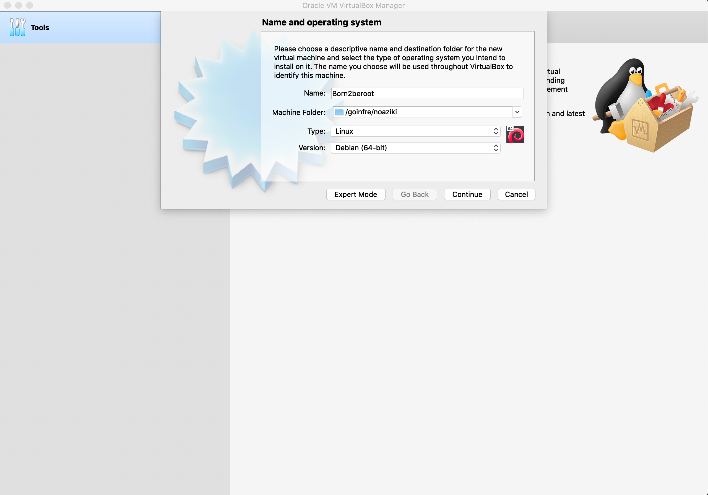
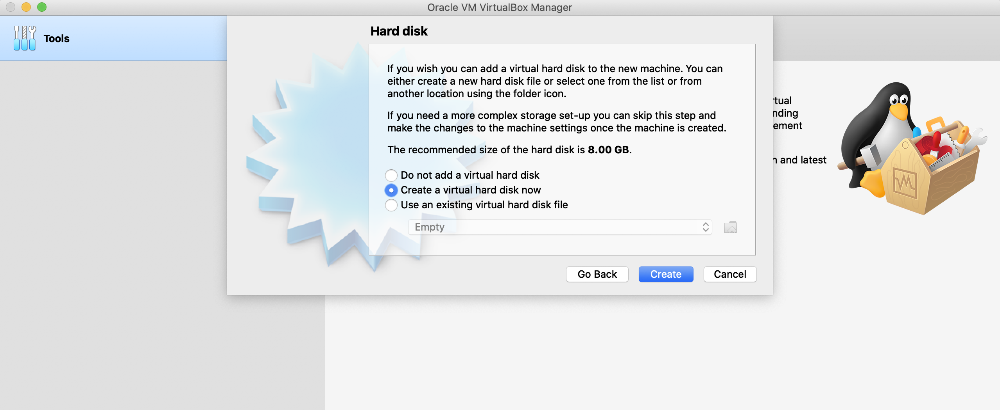

# Born2beroot

## Description
---

**Born2beroot** is your essential companion to mastering Linux system administration, designed to guide beginners and aspiring professionals into the world of root access and system management. This resource simplifies the complexities of Linux, offering clear, practical steps to help users build confidence and expertise.

From foundational concepts like file systems, permissions, and processes to advanced topics such as security, networking, and automation, Born to be Root equips you with the tools and knowledge to excel in system administration. Its hands-on tutorials and real-world examples provide a solid framework for tackling diverse challenges, ensuring you gain both understanding and practical skills.

By adopting the mindset of the root user — the ultimate superuser — you’re encouraged to explore, experiment, and take full control of your Linux environment. This guide empowers you to unlock the system’s full potential, transforming you into a confident and capable administrator.

Whether setting up servers, troubleshooting, or optimizing performance, **Born2beroot** is your trusted guide to navigating the dynamic world of Linux with ease and proficiency.

*For more check the [subject](subject.pdf)*

`Before starting, it's important to understand that each action in every step serves a specific purpose. You should know why it's being done and how it contributes to the overall process. A solid grasp of the technical context is crucial to fully comprehend the procedure.`

## Table of Contents
---

# Table of Contents

- [Check for VirtualBox](#step-1-check-for-virtualbox)
- [Selecting the Operating System](#step-2-selecting-the-operating-system)
- [Creating a New Virtual Machine in Oracle VirtualBox](#step-3-creating-a-new-virtual-machine-in-oracle-virtualbox)
- [Mount the ISO File and Start the Virtual Machine](#step-4-mount-the-iso-file-and-start-the-virtual-machine)
- [Installing Debian Operating System](#step-5-installing-debian-operating-system)
- [Virtual Machine Configuration](#step-6-virtual-machine-configuration)
- [Install sudo and Configure Users and Groups](#step-7-install-sudo-and-configure-users-and-groups)
- [Install and Configure the SSH](#step-8-install-and-configure-the-ssh)
- [Install and Configure the UFW](#step-9-install-and-configure-the-ufw)
- [Set a Strong Password for Your Sudo Privileges](#step-10-set-a-strong-password-for-your-sudo-privileges)
- [Strong Password Policy Settings](#step-11-strong-password-policy-settings)
- [Connect from SSH](#step-12-connect-from-ssh)
- [Writing the Bash Monitoring Script](#step-13-writing-the-bash-monitoring-script)
- [Crontab Setup for Monitoring Script](#step-14-crontab-setup-for-monitoring-script)
- [Wordpress and services configuration](#step-15-wordpress-and-services-configuration)
- [MariaDB](#step-16-mariadb)
- [PHP](#step-17-php)
- [Installing Netdata as an Extra Service](#step-18-installing-netdata-as-an-extra-service)
- [Customize Your Site](#step-19-customize-your-site)


## Step 1: Check for VirtualBox
---

To get started, ensure you have **VirtualBox** installed. If not, you can download it from [this link](https://www.virtualbox.org/). **VirtualBox** is essential for setting up the operating system we’ll be working with.

At 1337, **VirtualBox** is already available on the macOS devices, so you likely won’t need to install it. Double-check whether it’s already installed on your machine before proceeding.

### Some things you need to learn

- **VirtualBox**: Understand what VirtualBox is and how it works as a virtualization tool.
- **Virtualization**: Learn the concept of virtualization and its role in creating virtual environments.
- **Operating Systems**: Familiarize yourself with what operating systems are and their importance in managing computer hardware and software.
- **Hypervisor**: Discover the role of a hypervisor and how it enables virtualization by managing virtual machines.

❗❗For more details, check the [Guide for Virtual Machine and Linux Administration](Guide%20for%20Virtual%20Machine%20and%20Linux%20Administration.md), where you'll find explanations on all the concepts you'll need to learn.

## Step 2: Selecting the Operating System
---

### Debian vs Rocky Linux

When considering the operating system for the "**Born2beroot**" project, **Debian** stands out as the top recommendation. Here’s why:

1. **Stability and Reliability**: Debian is renowned for its robust stability, making it an ideal choice for server environments. With its established release cycle and thorough documentation, it offers a smooth experience for both beginners and advanced users alike.

2. **Extensive Community Support**: Debian is supported by a vibrant and engaged community, with a wealth of online resources to assist you. This active support network is especially valuable if you’re just starting out in system administration.

3. **Ideal for System Administration**: As specifically recommended for newcomers to system administration, Debian’s user-friendly package management (apt) and comprehensive documentation simplify the learning process. It’s a great choice for implementing essential tasks required by the project.

4. **Robust Security**: Debian comes with solid security features, including SELinux, which should be enabled at startup and configured as per the project requirements. AppArmor is also necessary to run at startup, adding another layer of security to the system.

5. **Project Compatibility**: Debian’s capabilities align perfectly with the project’s needs. From setting up encrypted partitions with LVM to implementing a strict password policy, configuring sudo, managing SSH access, and setting up a firewall with UFW, Debian supports all these requirements.

6. **Bonus Features**: Should you opt for the bonus section of the project, Debian provides a stable environment for additional services, like setting up WordPress or any custom service you prefer.

7. **Current Version**: The most recent stable version of Debian, as of this guide’s writing, is Debian 12.5. You can download the image from [this link](https://www.debian.org/download).

In conclusion, Debian offers a dependable, secure, and well-documented platform that fits perfectly with the project’s needs. It’s an excellent choice for gaining hands-on experience in system administration while ensuring your environment is well-supported and aligned with the project’s goals.

❗❗For more details, check the [Guide for Virtual Machine and Linux Administration](Guide%20for%20Virtual%20Machine%20and%20Linux%20Administration.md), where you'll find explanations on all the concepts you'll need to learn.

## Step 3: Creating a New Virtual Machine in Oracle VirtualBox
---

1. Launch Oracle **VirtualBox**.

2. Select the "**New**" button at the top of the window.


3.  In the name field, enter **'Born2beroot'** and change the version to **Debian (64-bit)**. Also, make sure to select the machine folder path as `Goinfre/home` if you are working on a computer of the school.


4. After pressing **continue** button, the **memory size** should automatically be set to **1024 MB** (1 GB), which is recommended. If it doesn’t appear as **1024 MB**, manually adjust it to that value.


5. After pressing **continue** button, When prompted with three options, select the second one: **Create a virtual hard disk now**.
   

6. After pressing **continue** button, In the **Hard disk file type** options, choose the first option: **VDI (VirtualBox Disk Image)**.
   

7. After pressing **continue** button, In the **Storage on physical hard disk** options, choose the first option: **Dynamically allocated**.
   

8.  After pressing **continue** button, set the size of the virtual hard disk to **30.80 GB** if you're going to work on the **bonus part** of the project. If you're only going to complete the **mandatory part**, choose **8 GB**. If you choose the **mandatory** option, you won't need the extra steps required for the **bonus part** later on. Since you're focusing on the **bonus**, you'll proceed with the 30.80 GB size.


9.  After pressing **continue** or **finished** button, you should see your new **Virtual Machine** created. To move on to the next step, go to **Settings** to start mounting an **ISO file**.


10. In **Settings**, click on the **Storage** tab, then select the **Empty** option under **Storage Devices**.


## Step 4: Mount the ISO File and Start the Virtual Machine
---

1. Once you’ve clicked on **Empty**, you should see a small disk icon similar to the one in the **screenshot below** next to the **optical drive**. Click on it.


2. Choose **debian-12.8.0-amd64-netinst.iso** from the list if it appears. If it doesn't show up, click on the **Choose a disk file** button and select the **debian-12.8.0-amd64-netinst.iso** file from the folder where you downloaded **Debian**.


3. Now, start the machine by clicking the **Start** button, so you can continue with the next step to install **Debian**.


## Step 5: Installing Debian Operating System

### Configuring the Language, Time Zone, and Keyboard Layout

1. The screen will appear as shown below. For a better viewing experience, right-click with your mouse, select the **Virtual Screen 1** option, and scale it to **200%**. After that, choose the **Install** option, as we will proceed without using a graphical interface.


2. Next, you’ll be prompted to select a language. I’m choosing English.


3. Enter your Country, Territory, or Area. Since I’m in Morocco 🇲🇦 I’ll select Other.


4. Choose your continent or region. In my case, it's Morocco 🇲🇦. I will start by selecting Africa.


5. Choose your Country, Territory, or Area. Since I’m Moroccan, I’ll select Morocco 🇲🇦.


6. For configuring locales, I’ll choose United States.


7. In keyboard configuration, Select American English to ensure the keys are correctly mapped; otherwise, the keyboard layout may not function as expected.


8. Once this steps is completed, you should see a window similar to the one below.


### Configuring the Network

1. The system will first ask for the **hostname**. As per the instructions, you should enter your **intra name** followed by **42**. In my case, it’s **noaziki42**.


2. For domain name, We'll leave this section blank, as the instructions do not specify any requirements for a domain name.


3. You’ll be prompted to enter a password for the system administrator account. It's important to write it down or take a photo for reference, as you will need it later. If you want to confirm that you've entered the password correctly, tab until you reach the **Show Password in Clear** option. Press the space bar, and the password will be displayed.


4. Now, you'll be asked to re-enter the password to confirm it. Make sure it matches the one you entered previously.


5. To avoid using the root account for non-administrative tasks, you'll be prompted to create a normal user account. I’ll enter my full name, **Nouhaila Aziki**, as the full name for the new user.


6. Now, you’ll be asked to provide a nickname or username for the non-root user. I’ll proceed with my intra username, **noaziki**, as the username for the new user.


7. You’ll need to choose a password for the non-root user. I’m proceeding with a new one, but if you think you might forget it, it's better to use the same password as the one for the Root User.


8. You’ll need to confirm the password for the non-root user. As I showed when setting the root password, you can use the arrows to navigate to the **Show Password** option and press the space bar to display it, ensuring it’s correct.


### Organizing Disk Partitions

Partitioning is an essential step in structuring disk space on your server. It helps to allocate different areas of the disk for specific functions.

1. Choose "Use Entire Disk and Set Up Encrypted LVM": This guided option automatically partitions your disk and configures encrypted Logical Volume Manager (LVM), which is mandatory as per the project's requirements.

However!!! If you're planning to tackle the bonus section of the project, you should select "Manual" and proceed with custom partitioning. This serves as a heads-up for those interested in the bonus. Otherwise, feel free to stick with the default guided partitioning method and skip this step.

I will continue with the custom partitioning for the bonus task, but you're free to opt for the guided approach if you prefer.


2. In this section, you’ll see a general description of your partitions and mount points. Since we haven’t created any partitions yet, we need to create a  new partition table. To do this, choose the device where you want to create the partitions. In my case, I’ll select the only available device: SCSI2 (0, 0, 0) (sda) - 33.1 GB ATA VBOX HARDDISK.

Don’t be confused if you see SCSI3 instead, as the SCSI controller number is assigned automatically by VirtualBox and may vary between installations or configurations. This number is just a virtual representation of the disk controller used by the virtual machine. As long as you choose the correct disk (sda) with the correct capacity (33.1 GB ATA VBOX HARDDISK), you should be good to go.


3. Click **Yes** to confirm the device selection.


4. After completing the previous step, you’ll see an empty partition table. To configure it, select the **FREE SPACE** in order to create the partitions.


5. Create a new partition.


6. Following the image provided in the subject, we will create the partitions one by one (this image from the bonus part).


7. As indicated in the subject, the size of the first partition should be **500.99 megabytes**.


8. I will briefly explain the different types of sections:

`Primary Partition: This is the only type of partition that can hold an operating system. A hard drive can have up to four primary partitions, or three primary partitions and one extended partition.`

`Extended Partition: Designed to overcome the limit of four primary partitions on a single disk, only one extended partition can exist per disk. It serves as a container for logical partitions.`

`Logical Partition: This partition exists within an extended partition and is formatted with a specific file system, like ext4. Once formatted, it is recognized by the operating system as a separate drive. While you can have up to 23 logical partitions in theory, Linux limits this to 15 logical partitions for practical use, which is more than enough for the scope of this project.`

For this step, we will choose Primary because it will be the partition where the Operating System will be installed.


9. We will select **Beginning** because we want the new partition to be created at the start of the available space on the disk.


10. The following screenshot displays the partition details. We will modify the mount point according to the specifications provided in the project instructions.


11. We will choose **/boot** as the mount point for our partition, as specified in the project instructions.


12. We have finished configuring the current partition.


13. Once we have completed the previous step, the partition should appear. Next, we need to create a logical partition using all the remaining available disk space. This partition will have no mount point and will be encrypted. To do this, we select the free space where we want to create the logical partition.

14. Create a new partition


15. We will follow the example provided in the subject for creating the logical partition.


16. We will select max for this partition to utilize all the remaining available disk space.


17. Since we need to create the LVM, we must select Logical for this partition type.


18. For this partition, we will not assign a mount point, as it is meant to be encrypted and used for LVM (Logical Volume Management).


19. In the context of virtual machines (VMs) and disk management, logical partitions are typically not mounted directly because they are part of a larger virtual disk image or disk file. Instead, they are used as components of LVM (Logical Volume Management), where they are combined into logical volumes that are then mounted for use by the system.


20. Now that we have selected Logical for the partition type and left it without a mount point, we can finish the partitioning process by confirming and applying the changes. Once done, the logical partition will be created, and we'll proceed to the next steps in the setup process.


21. Let's configure the encrypted volumes now


22. Accept the confirmation message to proceed with configuring the encrypted volume. This step finalizes the encryption setup and applies the necessary changes to the partition.


 23. Waiting for upload.


 24. Now, we proceed to create the encrypted volumes. This step involves setting up the partition for encryption to ensure data security.


25. We select the partition we want to encrypt. Use the arrow keys to navigate to /dev/sda5, and press the space bar to select it.


26. We have completed the configuration of the current partition and can now proceed to the next step.


27. We are done with this step, as we do not need to create any additional encrypted volumes.


28. We accept the confirmation message, which informs us that everything within the selected partition will be encrypted. The process should complete quickly.


29. We don't mind whether it takes a long time or a short time; we simply click 'Cancel' because there is nothing to encrypt, as the partition is empty.


30. Once again, we will need to enter a password, but this time it will be the encryption phrase. As I mentioned earlier, you must repeat the process and write it down, as it will be important in the future.


31. Confirm the password.


32. Now we'll configure the Logical Volume Manager.


33. We will accept the confirmation message, as we agree that the changes will be saved to the disk.


34. Let's create a new volume group. A volume group combines multiple partitions.


35. We need to assign the name as specified in the instructions: LVMGroup.


36. Select the partition where the group should be created.


37. We need to create them according to the example provided in the instructions.


38. We'll begin by selecting the group where we want them to be created. Choose the only available group (the one we just created).


39. We'll follow the sequence outlined in the subject for creating the logical volume, beginning with the root and finishing with var-log. After that, we’ll choose a name for each logical volume accordingly.


40. As specified in the subject, the size will be set to 10gib.


41. To avoid repetition, proceed by applying the same process to all partitions in the volume group. Assign each one the same name and size as outlined in the example above.


42. Once you’ve created all the logical volumes as specified, your window should match the one shown below. At this point, simply type `"finish"` to complete the process.


43. Now, in the section displaying all the partitions and available free space, you should see all the logical partitions we just created. Our next step is to configure each one by selecting the desired file system and the corresponding mount point as specified in the subject. We’ll proceed in order, starting with the first partition that appears, which is "home," by pressing Enter.

   
44. It will display the partition configuration. Since the partition currently lacks a file system, we need to assign one. To do this, press Enter on the `"Use as"` option, which is currently set to `"Do not use."`


45. Select the Ext4 file system, as it is the most commonly used file system in Linux distributions.


46. Next, we need to select the mount point by pressing Enter on the "Mount point" option.


47. For the "home" partition, select "home" as the mount point. For future partitions, choose the appropriate mount points specific to each one to avoid repetition.


48. The partition setup is complete.


49. Now, proceed with the same steps for all the partitions. For the var/log partition, manually enter the mount point. For the swap partition, instead of choosing a file system, select "swap area" after you click `"Use as: Do not use."`, Once all the partitions are configured, click "Finish partitioning" and confirm to write the changes to the disk.


50. Confirm the changes, and after that, you will see the installation progress bar.


51. It will prompt us to install additional packages. However, select "No" since they are not needed for this setup.


52. Choose the country that is specific to your location. This will set the appropriate time zone and regional settings for your system.


53. Choosing `deb.debian.org` ensures faster, reliable, and secure package downloads by automatically selecting the best mirror based on your location.


54. Leave this field empty and press `continue`


55. Since we do not want developers to see our statistics, select `"No"`


56. Remove all software options by pressing the space bar and then click "Continue," as these options are forbidden according to the subject.


57. Select "Yes" to install the GRUB bootloader on the hard drive. GRUB is essential in the boot process of Linux-based operating systems, providing a flexible and customizable bootloader that manages system booting, kernel loading, and system recovery.


58. Next, choose the device for the bootloader installation. Select /dev/sda (ata_VBOX_HARDDISK) as the target for the GRUB bootloader. This ensures that your system will boot from the correct hard drive.


59. Type `"Continue"` to complete the installation and finish setting up your system.


## Step 6: Virtual Machine Configuration
---

1. The first step is to enter the encryption password that you previously set up during the installation process. This will unlock the encrypted disk and allow the system to boot successfully.


2. Next, enter the username and password for the non-root user that you created during the installation process. This will log you into the system with regular user privileges.


3. Make sure that the sections are set up correctly and that the result is similar to the structure shown in the subject.


Great! 🎉 Now that everything is set up, you're ready to begin configuring your Debian virtual machine. You can now proceed with installing any necessary software, setting up your development environment, or customizing the system to suit your needs. Enjoy exploring your virtual machine!

## Step 7: Install sudo and configure users and groups
---

1. To install **sudo**, we first need to switch to the root user. Open the terminal, type `su` or `su -`, and enter the root password when prompted. Once logged in as root, run the command `apt install sudo` to install the required package. After installation, restart the machine to apply the changes. Use the command `sudo reboot` to reboot the system and wait for it to restart.


2. After rebooting, re-enter the encryption and user passwords. To ensure sudo was installed correctly, log in as the root user again and run the command `sudo -V`, this will show the sudo version, along with the configuration arguments and available plugins that provide additional details. Next, switch to the root user using `su` or `su -`. Then, attempt to create a user with the same name as the non-root user currently logged in using `sudo adduser your_login`. Since the user was already created during the installation, you should receive a message indicating that the user already exists.


 3. Next, we need to create a new group called user42. To do this, run the following command `sudo addgroup user42`, this will add the new group to the system.


4. ```Have you heard of **GID**? It stands for **Group Identifier**—essentially the unique ID assigned to each group in Unix-like systems. Similar to how users are given a **UID** (User ID), groups are identified by their **GID**. This identifier is key for managing permissions and access control, allowing users in the same group to collaborate and share resources seamlessly. Think of the **GID** as the group’s digital signature, ensuring efficient organization and coordination within the system.```

❗❗For more details, check the [Guide for Virtual Machine and Linux Administration](Guide%20for%20Virtual%20Machine%20and%20Linux%20Administration.md), where you'll find explanations on all the concepts you'll need to learn.

 Was the group created successfully? Yes, since no error message appeared, the group has been created properly. To confirm, you can use the command `getent group group_name`.

Running the command `cat /etc/group` will display the contents of the **/etc/group** file, which includes a list of all groups on your system, along with their **GID** and members. The output will look something like this:


5. To add a user to a group, you can use the command `sudo adduser username group_name`, this command will include the user in the specified group. In this case, we need to add the user to both the sudo and user42 groups. To do this, run `sudo adduser username sudo` and `sudo adduser username user42`. After adding the user to the groups, you can verify that everything is set up correctly by using the command `getent group group_name`. Alternatively, you can open and edit the `/etc/group` file using `sudo vim /etc/group`. In this file, you should see the username listed under both the sudo and user42 groups. This confirms that the user is correctly added to the groups.


## Step 8: Install and configure the SSH
---

```🔒 **SSH**, or **Secure Shell**, serves as both a protocol and a tool for securely accessing remote servers. It establishes an encrypted communication channel, ensuring that all data exchanged between the client and the server remains confidential and intact. This strong encryption makes SSH indispensable for secure remote management and file transfers.```

❗❗For more details, check the [Guide for Virtual Machine and Linux Administration](Guide%20for%20Virtual%20Machine%20and%20Linux%20Administration.md), where you'll find explanations on all the concepts you'll need to learn.

1. The first step is to update the package repositories we defined in the /etc/apt/sources.list file. To do this, run the following command in your terminal: `sudo apt update`. This command refreshes the list of available packages from the repositories, ensuring that the system is aware of the latest versions and updates.


2. Next, we’ll install the primary connectivity tool for remote login using the SSH protocol: OpenSSH. To install it, we’ll enter the following command `sudo apt install openssh-server`. When prompted with a confirmation message, type Y to proceed, and then wait for the installation to complete.

After running the installation command, you should see an output similar to the following:

To verify that OpenSSH has been installed correctly, we’ll run the following command `sudo service ssh status`. If the installation was successful, you should see an output indicating that the SSH service is active and running, similar to this:

This confirms that SSH is up and running.

2. After completing the installation, there are configuration files that we need to adjust. For this, we’ll use vim(to install vim use the command `apt install vim`), or any other preferred text editor. The first file to modify is located at `/etc/ssh/sshd_config`. If you're not logged in as the root user, you might not have the necessary write permissions. In such cases, you can either. Switch to the root user by running `su -`, followed by entering the root password. Or, simply prepend sudo to the command to temporarily gain root privileges, like this `sudo vim /etc/ssh/sshd_config`. This allows you to edit the configuration file with the proper permissions.

The following image illustrates the vim installation stage.

This command below is to open /etc/ssh/sshd_config

You have to see as in the picture


In the SSH configuration file (/etc/ssh/sshd_config), lines that begin with a # are commented out, meaning they are inactive. To modify these lines, we will need to remove the comment (the #) and then update the values. Once you're editing the file, locate the following lines and modify them as shown. Change the port number:
`#Port 22`
Remove the # and change the port to 4242, so the line should look like this:
`Port 4242`
Disable root login:
`#PermitRootLogin prohibit-password`
Remove the # and set root login to no:
`PermitRootLogin no`
After making these changes, save the file and exit the editor with `ESC` and `:wq!` .


3. Next, we need to edit the file located at: `/etc/ssh/ssh_config`

Uncoment the Port 22 and change it to 4242


4. Finally, to apply the changes we’ve made, we need to restart the SSH service. To do this, run the following command: `sudo service ssh restart`. Once the service has been restarted, you can check its status to confirm that the changes have been applied correctly. Use the following command: `sudo service ssh status`. Look for the Port 4242 line in the output to verify that the server is now listening on the new port. It should look similar to this:

This confirms that SSH is now operating on Port 4242 as intended.

## Step 9: Install and configure the UFW
---


```🔒 **UFW** (Uncomplicated Firewall) is a user-friendly front-end for managing **iptables**, the default firewall configuration tool used by many Linux distributions. It simplifies the process of configuring firewall rules through an intuitive command-line interface. This makes it easy for users to control network traffic and strengthen system security with just a few commands.```
```With UFW, even users with limited experience in firewall management can quickly set up and maintain strong firewall policies, protecting their systems from unauthorized access and potential threats.```

❗❗For more details, check the [Guide for Virtual Machine and Linux Administration](Guide%20for%20Virtual%20Machine%20and%20Linux%20Administration.md), where you'll find explanations on all the concepts you'll need to learn.

1.  To get started, the first step is to install UFW. Open your terminal and run the following command: `sudo apt install ufw`
When prompted, type 'y' to confirm that you want to install the package, and then wait for the installation to complete. This will prepare your system for configuring the firewall and enhancing its security.


2- After installing UFW, the next crucial step is to enable it. To do so, run the following command in your terminal: `sudo ufw enable`
Upon execution, you should receive a confirmation message indicating that the firewall is now active. This ensures your system is better protected against unauthorized access, enhancing its overall security.
Now, let’s configure the firewall to allow connections through port 4242. Run the following command in your terminal: `sudo ufw allow 4242`
This will allow traffic on port 4242, ensuring your desired services or applications can communicate freely.
Finally, let’s verify that everything is set up correctly by checking the status of the firewall. To do this, execute the command: `sudo ufw status`
You should see a list of allowed connections, with port 4242 listed as allowed. This confirms that your firewall is effectively protecting your system while allowing the necessary communication.


## Step 10: set a strong password for your sudo privileges

1. Next, we’ll create a file at the path /etc/sudoers.d/ to store our password configuration. For clarity, we’ll name the file sudo_config.

Execute the following command in your terminal to create the file: `touch /etc/sudoers.d/sudo_config`
This file will be important for securely managing your sudo password settings.


2. To fulfill the requirement of storing all sudo commands' input and output, we need to create a directory named sudo within the /var/log path.
Run the following command in your terminal to create this directory: `mkdir /var/log/sudo`
This ensures that all sudo activities are logged centrally, which is essential for system administration and security monitoring.


3. Now, let's edit the file we created in the previous step. As mentioned, you can use any text editor, but for simplicity, we'll use Nano.
Execute the following command in your terminal to open the file for editing: `vim /etc/sudoers.d/sudo_config`

This step allows you to securely and effectively configure password policies within the sudo_config file.
You need to write this bash code in the file:
```bash
Defaults    passwd_tries=3
Defaults    badpass_message="The password you entered does not meet the requirements or is incorrect"
Defaults    logfile="/var/log/sudo/sudo_config"
Defaults    log_input, log_output
Defaults    iolog_dir="/var/log/sudo"
Defaults    requiretty
Defaults    secure_path="/usr/local/sbin:/usr/local/bin:/usr/sbin:/usr/bin:/sbin:/bin:/snap/bin"
```

Here's an explanation of each line in the code you provided:

- `Defaults passwd_tries=3`
	- This sets the maximum number of times a user can attempt to enter their password when using sudo.
	- If the user fails three times, their access is denied.
- `Defaults badpass_message="The password you entered does not meet the requirements or is incorrect"`
	- This customizes the error message displayed when a user enters an incorrect password while trying to use sudo.
	- Instead of the default message, the user will see this specific one.
	- You can be creative with your badpass_message.
- `Defaults logfile="/var/log/sudo/sudo_config"`
	- Specifies the path to a custom log file where all sudo activities are logged.
	- This log can be useful for auditing purposes.
- `Defaults log_input, log_output`
	- Logs the input and output of commands executed with sudo.
	- log_input: Records what the user types when running a sudo command.
	- log_output: Records the output generated by the sudo command.
	- Together, they help in monitoring user activities for security or debugging.
- `Defaults iolog_dir="/var/log/sudo"`
	- Specifies the directory where the input/output logs (set by log_input and log_output) are stored.
	- In this case, logs will be saved in /var/log/sudo.
- `Defaults requiretty`
	- Ensures that sudo commands can only be executed from a terminal session (TTY).
	- This adds a layer of security by preventing scripts or non-interactive sessions from running sudo commands.
- `Defaults secure_path="/usr/local/sbin:/usr/local/bin:/usr/sbin:/usr/bin:/sbin:/bin:/snap/bin"`
	- Defines the PATH environment variable used when executing commands with sudo.
	- This ensures that only trusted directories are searched for executables, reducing the risk of malicious scripts being executed.
- Purpose of These Settings:
	- Enhanced Security: Limits password attempts and enforces terminal-only usage for sudo.
	- Customization: Provides a user-friendly error message.
	- Auditing: Logs user activities and command execution for troubleshooting or monitoring.
	- Controlled Execution: Ensures only trusted paths are used for sudo commands.

## Step 11: Strong Password Policy Settings 

1. The first step will be to edit the login.defs file.


2. In the sudo_config file, we'll set the password expiration policies. To do this, modify the following lines:
Change: `PASS_MAX_DAYS 99999` To: `PASS_MAX_DAYS 30`
And change: `PASS_MIN_DAYS 0` To: `PASS_MIN_DAYS 2`
These changes ensure that the maximum password age is set to 30 days, requiring users to change their passwords periodically, and the minimum password age is set to 2 days, preventing users from changing their password too quickly after a reset.


Now, let’s delve into configuring password policies:

- **PASS_MAX_DAYS**: This parameter sets the maximum number of days a password can be used before it expires. After this period, the user will be required to change their password. For example `PASS_MAX_DAYS 30`. This means the password will expire after 30 days.

- **PASS_MIN_DAYS**: This parameter defines the minimum number of days a password must be used before it can be changed again. It prevents users from changing their passwords too frequently. For example `PASS_MIN_DAYS 2`. This means the user must wait at least 2 days before changing their password again.

- **PASS_WARN_AGE**: This setting triggers a warning message to users, notifying them of their password’s impending expiration within the specified number of days. For example `PASS_WARN_AGE 7`. This means users will be warned 7 days before their password expires.

By configuring these parameters, you ensure better control over password management and security in your system.

3. To continue with the configuration and enhance password security, we need to install the necessary packages. Run the following command in your terminal `apt install libpam-pwquality`. When prompted, type 'Y' to confirm the installation and wait for the process to complete.
These packages provide additional password quality checking capabilities, allowing you to enforce stronger password policies and improve your system's security.


4. To proceed with configuring password policies, we need to modify the common-password file. This file controls how the system handles password settings. Use the following command to open the file for editing `vim /etc/pam.d/common-password`. Once the file is open, you can make the necessary changes to configure password policies effectively. This step will help ensure that the system enforces the appropriate password quality and security settings.


5. After the retry=3 option in the /etc/pam.d/common-password file, we need to add the following commands to enforce stronger password policies:

```bash
minlen=10
ucredit=-1
dcredit=-1
lcredit=-1
maxrepeat=3
reject_username
difok=7
enforce_for_root
```


Here’s what each parameter does:

- `minlen=10`: Sets the minimum password length to 10 characters.
- `ucredit=-1`: Requires at least 1 uppercase letter in the password.
- `dcredit=-1`: Requires at least 1 digit (number) in the password.
- `lcredit=-1`: Requires at least 1 lowercase letter in the password.
- `maxrepeat=3`: Limits the maximum number of consecutive identical characters to 3.
- `reject_username`: Ensures that the password does not contain the username.
- `difok=7`: Requires at least 7 characters to be different from the previous password.
- `enforce_for_root`: Enforces these password rules even for the root user.
These settings help to enforce robust password policies that enhance the overall security of your system.

6. Don't forget to set and confirm password aging policies for both user and root.


Sets the minimum and maximum password age for both user and root:
`-m 2`: The user and root must wait at least 2 days between password changes.
`-M 30`: The user and root must change their password within 30 days.

## Step 12: Connect from SSH
---

1. Before closing the virtual machine, it’s important to save a snapshot through VirtualBox’s configuration settings. This will allow you to easily revert to the current state of the machine if needed.

To do this, navigate to the Snapshot Manager in VirtualBox and create a new snapshot with a descriptive name. This step ensures that your progress and configurations are preserved.

🔒 Next, to establish SSH connectivity, start by closing the virtual machine. Then, reopen VirtualBox and navigate to the machine's configuration settings. From there, we will adjust the network settings to enable SSH access for the virtual machine.

This step prepares the virtual machine for remote administration through SSH.

Once you're in the virtual machine's configuration settings in VirtualBox, navigate to the Network tab. Here, you'll need to configure the port for SSH connectivity:

Under Adapter 1, ensure the network is set to NAT.

Click on Advanced and then Port Forwarding.

In the Port Forwarding rules window, add a new rule:

Protocol: TCP
Host IP: Leave this blank.
Host Port: Choose a port number on your host machine, in our case we will choose 4242.
Guest IP: Leave this blank.
Guest Port: Set this to 4242.
This will forward traffic from port 4242 on your host machine to port 4242 on the virtual machine, enabling SSH connectivity.

Once this is set, click OK to save the changes, and you’ll be ready to connect to your virtual machine via SSH using the specified port.


2. To connect to the virtual machine from the host machine, open a terminal on the host and type the following command:
```bash
ssh your_login@localhost -p 4242
```
This command initiates an SSH connection to the virtual machine, specifying the username and port 4242. You will be prompted to enter the password for the user. Once authenticated, you should see the login prompt, which typically appears in green, indicating a successful connection.

Ensure your virtual machine is running while you attempt to connect via SSH.

If you encounter a problem like the one below:

This message appears because SSH's strict host key checking detected a change in the host key of the server you're trying to connect to (localhost in this case).
You just have to do the following:
```
vim ~/.ssh/known_hosts
```
Delete the line containing [localhost]:4242..., Save the file and then try connecting again.


## Step 13: Writing the Bash Monitoring Script
---

Entering this section requires close attention to detail. It's essential to fully understand everything presented here. Don't try to take shortcuts! During the evaluation, you'll most likely be asked about the script's functionality or how it operates.

### What is a script?
A script is a file containing a sequence of commands. When executed, these commands perform specific tasks outlined in the script.

### 1. Shebang Line
```bash
#!/bin/bash
```
- This tells the system to execute the script using the Bash shell.

### 2. Fetching System Architecture
```bash
architecture=$(uname -a)
```
- `uname -a`: Displays system information, including OS type, kernel version, etc.
- `architecture=`: Stores this information in the architecture variable.

### 3. Counting Physical CPUs
```bash
cpu_physical=$(lscpu | grep "Socket(s)" | awk '{print $2}')
```
- `lscpu`: Displays CPU information.
- `grep "Socket(s)"`: Finds the line with "Socket(s)", which represents physical CPU sockets.
- `awk '{print $2}'`: Extracts the second column (number of physical CPUs).


### 4. Counting Virtual CPUs 
```bash
cpu_virtual=$(lscpu | grep "^CPU(s)" | awk '{print $2}')
```
- `lscpu`: Gets CPU info.
- `grep "^CPU(s)"`: Finds the total number of CPU cores (physical + virtual/hyper-threading).
- `awk '{print $2}'`: Extracts the second column (total vCPUs).

### 5. Checking Memory Usage
```bash
memory_usage=$(free --mega | grep Mem | awk '{printf("%d/%dMB (%.2f%%)\n", $3, $2 , $3/$2*100)}')
```
- `free --mega`: Shows memory usage in MB.
- `grep Mem`: Filters the line with total and used memory.
- `awk '{printf("%d/%dMB (%.2f%%)\n", $3, $2 , $3/$2*100)}'`:
	- `$3`: Used memory.
	- `$2`: Total memory.
	- `$3/$2*100`: Calculates percentage.

### 6. Checking Disk Usage
```bash
disk_usage=$(df -Bm --total | grep total | awk '{printf("%d/%dGb (%d%%)\n", $3, $2/1000, $3/$2*100)}')
```
- `df -Bm --total`: Shows the total of disk usage in MB.
- `grep total: Filters the last line, which gives total disk space.
- `awk '{printf("%d/%dGb (%d%%)\n", $3, $2/1000, $3/$2*100)}'`:
- `$3`: Used disk space.
- `$2/1000`: Converts total disk space to GB.
- `$3/$2*100`: Calculates percentage.

### 7. Checking CPU Load
```bash
cpu_load=$(vmstat 1 2 | tail -1 | awk '{printf("%.1f%%", 100 - $15)}')
```
- `vmstat 1 2`: Runs vmstat twice (1-second interval).
- `tail -1`: Takes the last line (latest stats).
- `$15`: Idle CPU percentage.
- `100 - $15`: Converts idle % to active CPU %.

### 8. Checking Last Boot Time
```bash
last_boot=$(who -b | awk '$1 == "system" {print $3 " " $4}')
```
- `who -b`: Shows the last boot time.
- `awk '$1 == "system" {print $3 " " $4}'`: Extracts date and time.

### 9. Checking LVM Usage
```bash
lvm_use=$(lsblk | awk '{print $6}' | grep -q lvm && printf "yes\n" || printf "no\n")
```
- `lsblk`: Lists disk partitions.
- `awk '{print $6}'`: Extracts the 6th column (LVM status).
- `grep -q lvm`: Checks if any partition uses LVM.
- `&& printf "yes\n" || printf "no\n"`: Outputs "yes" if LVM is used, else "no".

### 10. Checking Established TCP Connections
```bash
connections_tcp=$(ss -ta | grep ESTAB | wc -l)
```
- `ss -ta`: Lists all TCP connections.
- `grep ESTAB`: Filters only established connections.
- `wc -l`: Counts the number of established connections.

### 11. Counting Logged-in Users
```bash
user_log=$(users | tr ' ' '\n' | sort -u | wc -w)
```
- `users`: Lists currently logged-in users.
- `tr ' ' '\n'`: Converts spaces to new lines.
- `sort -u`: Sorts and removes duplicates.
- `wc -w`: Counts unique users.

### 12. Getting Network Information
```bash
network=$(hostname -I | tr '\n' ' ' && ip link | grep /ether | awk '{print $2}')
```
- `hostname -I`: Shows IP addresses.
- `tr '\n' ' '`: Replaces new lines with spaces.
- `ip link | grep /ether | awk '{print $2}'`: Extracts MAC address.

### 13. Counting Sudo Commands Executed
```bash
sudo=$(journalctl _COMM=sudo | grep COMMAND | wc -l)
```
- `journalctl _COMM=sudo`: Lists sudo command logs.
- `grep COMMAND`: Filters only command executions.
- `wc -l`: Counts occurrences.

### 14. Displaying the Collected Information
```bash
wall "
	#Architecture: $architecture
	#CPU physical: $cpu_physical
	#vCPU: $cpu_virtual
	#Memory Usage: $memory_usage
	#Disk Usage: $disk_usage
	#CPU load: $cpu_load
	#Last boot: $last_boot
	#LVM use: $lvm_use
	#Connections TCP: $connections_tcp ESTABLISHED
	#User log: $user_log
	#Network: IP $network
	#Sudo: $sudo cmd
"
```
- `wall`:(all warnings) Broadcasts the message to all logged-in users.
- Displays system stats in a formatted output.

⚠️ Reminder: Do not copy and paste these commands without fully understanding them! and verify this commands by executing it⚠️

To create the Bash file for the monitoring script, connect via SSH, switch to superuser mode, and use `vim monitoring.sh`.


Once you’re in the vim editor, press i to enter insert mode and then start writing the script.
!!Ensure you understand every command and section of the script, as you’ll likely need to explain it during evaluation.!!

And write the script inside like below

```bash
#!/bin/bash

architecture=$(uname -a)

cpu_physical=$(lscpu | grep "Socket(s)" | awk '{print $2}')

cpu_virtual=$(lscpu | grep "^CPU(s)" | awk '{print $2}')

memory_usage=$(free --mega | grep Mem | awk '{printf("%d/%dMB (%.2f%%)\n", $3, $2 , $3/$2*100)}')

disk_usage=$(df -Bm --total | grep total | awk '{printf("%d/%dGb (%d%%)\n", $3, $2/1000, $3/$2*100)}')

cpu_load=$(vmstat 1 2 | tail -1 | awk '{printf("%.1f%%", 100 - $15)}')

last_boot=$(who -b | awk '$1 == "system" {print $3 " " $4}')

lvm_use=$(lsblk | awk '{print $6}' | grep -q lvm && printf "yes\n" || printf "no\n")

connections_tcp=$(ss -ta | grep ESTAB | wc -l)

user_log=$(users | tr ' ' '\n' | sort -u | wc -w)

network=$(hostname -I | tr '\n' ' ' && ip link | grep /ether | awk '{print $2}')

sudo=$(journalctl _COMM=sudo | grep COMMAND | wc -l)

wall "
	#Architecture: $architecture
	#CPU physical: $cpu_physical
	#vCPU: $cpu_virtual
	#Memory Usage: $memory_usage
	#Disk Usage: $disk_usage
	#CPU load: $cpu_load
	#Last boot: $last_boot
	#LVM use: $lvm_use
	#Connections TCP: $connections_tcp ESTABLISHED
	#User log: $user_log
	#Network: IP $network
	#Sudo: $sudo cmd
"
```


After successfully running the script, you should see output that gives you a detailed summary of your system's performance and configuration. The following is an example of what you might see after executing the monitoring script:


## Step 14: Crontab Setup for Monitoring Script
---

1. What is Crontab?
Crontab (Cron Table) is a configuration file that schedules jobs (commands or scripts) to run at specific times or intervals. Each line in the crontab file represents a task that will be executed automatically at the designated time.

2. Open Crontab for Editing
To schedule the monitoring script to run at regular intervals, you'll need to edit the crontab file. Use the following command:

```bash
crontab -e
```
or
```bash
crontab -u root -e
```
This opens the crontab configuration file in your default text editor.
you will be prompted to select an editor, choose the first one as it is the easiest.


3. Define the Frequency of Execution
Crontab uses a specific format to schedule tasks. The format consists of five fields:

Crontab Syntax:
```bash
m h dom mon dow command
```
### Fields Explained:
- m (Minute):
The minute when the command should run.
	- Valid values: 0-59
	- Example: 5 means the task will run at the 5th minute of the hour.
- h (Hour):
The hour when the command should run (24-hour format).
	- Valid values: 0-23
	- Example: 14 means the task will run at 2:00 PM.
- dom (Day of Month):
The specific day of the month when the command should run.
	- Valid values: 1-31
	- Example: 15 means the task will run on the 15th day of the month.
- mon (Month):
The specific month when the command should run.
	- Valid values: 1-12 or abbreviated names (jan, feb, etc.)
	- Example: 7 means the task will run in July.
- dow (Day of Week):
The day of the week when the command should run.
	- Valid values: 0-7 (where 0 and 7 both represent Sunday), or abbreviated names (sun, mon, etc.)
	- Example: 5 or fri means the task will run on Friday.
- command:
The actual script or command you want to execute.

### Example
```scss
*    *    *    *    *  command_to_be_executed
-    -    -    -    -
|    |    |    |    |
|    |    |    |    |  
|    |    |    |    ----- Day of the week (0 - 7) (Sunday is both 0 and 7)
|    |    |    --------- Month (1 - 12)
|    |    --------------- Day of the month (1 - 31)
|    -------------------- Hour (0 - 23)
------------------------- Minute (0 - 59)
```
Example:
If you want the script to run every 10 minutes, add the following line to the crontab file:
```bash
*/10 * * * * /path/to/your/script/monitoring.sh
```
In this example:
*/10: Runs the script every 10 minutes.

Inside the file, you will add the following command: 
- If you have the monitoring.sh file in user folder:
```@reboot sh /home/your_login/monitoring.sh```

This will ensure that the script runs once every 10 minutes after a reboot.

- If you have the monitoring.sh file in root folder, like me:
```@reboot sh /root/monitoring.sh```

This will ensure that the script runs once every 10 minutes after a reboot.

In this case, the command `@reboot sh /home/your_login/monitoring.sh` added to your crontab makes your script run automatically at system startup. Here's how crontab works in this context:

- `@reboot`: This is a special time specification in crontab that schedules your script to run every time the system starts or reboots. It ensures your monitoring script starts as soon as the system is up and running.

- `sh /home/noaziki/monitoring.sh`: This part of the crontab entry specifies the command to be executed. In this case, it's telling the system to run your Bash script (monitoring.sh) using sh.

- `Script Execution`: When your system boots, crontab triggers the script located at /home/noaziki/monitoring.sh.

Do you remember the script, we'll go back to it to add this part?
```bash
while true;
do
	sleep 600
done
```
It will be like this:


Let's analyze it now.

- `while true;`: This creates an infinite loop. The condition true always evaluates as "true," meaning the loop will never exit on its own. It's used when you want a section of code to run repeatedly without stopping until the program is manually terminated or the system shuts down.

- `do`: This marks the beginning of the commands that will be executed inside the loop. In your case, everything between do and done will repeat.

- `sleep 599`: The sleep command pauses the execution of the script for 599 seconds (about 10 minutes) each time the loop iterates. After this 10-minute pause, the script continues to gather system metrics and then broadcasts the results.

How It Works:

- Loop Cycle: The script enters the loop (while true) and then sleeps for 599 seconds. After the sleep period ends, it collects the system metrics and displays them using the wall command.

- Repeat: After displaying the metrics, the loop starts again, waits for another 599 seconds, and repeats the process indefinitely.
In essence, this part of the script ensures that the system monitoring task is executed approximately every 10 minutes.

- Script Output: Each time the script runs, it gathers various system metrics (architecture, CPU, memory, disk usage, etc.) and uses the wall command to broadcast the information to all logged-in users on the terminal.

In short, every time your system reboots, this script runs in the background and continuously monitors your system's status, updating every 10 minutes.

## Step 15: Wordpress and services configuration
---

### What is WordPress?
WordPress is an open-source content management system (CMS) used to create and manage websites. It’s one of the most popular platforms on the internet, powering millions of websites globally.

### What is LightPad?
LightPad is not as widely recognized as WordPress, and it could refer to different things depending on context. However, based on available information, there are a couple of general interpretations for "LightPad" that are commonly referenced:

- LightPad (Productivity/Note-Taking App):

	- LightPad could be a reference to a type of note-taking or productivity tool.
	- These apps focus on providing a simple and streamlined interface for users to take notes, jot down ideas, or create to-do lists.
	- Example Use Case: Professionals, students, or creatives may use it for quick note-taking or brainstorming sessions.

- LightPad (Web Development):

	- In some contexts, LightPad refers to a lightweight web development tool or editor.
	- It could be designed to help developers write and test code quickly with a minimal interface, suitable for small or experimental projects.

- LightPad (Art or Design):

	- In other scenarios, LightPad may refer to a physical product, like a lightbox or light pad used in the art and design industry.
	- Artists use these products to trace images or work with translucent materials.
	- It’s a flat, illuminated surface that helps artists see their designs clearly when working with layers.

1. Installation

Begin by installing lighttpd, a lightweight web server, which is suitable for hosting small to medium-sized sites. Use the following command to install it:
```bash
apt install lighttpd
```

This command will download and install lighttpd on your system. Make sure to use sudo for the necessary administrative privileges.

2. Allow Connections Through Port 80

Port 80 is the default port for HTTP traffic, which is used by web servers like lighttpd. To ensure your server is accessible, you need to allow traffic through this port using the Uncomplicated Firewall (UFW):
```bash
sudo ufw allow 80
```
This rule opens port 80 to allow incoming HTTP traffic, which is essential for users to access your website.

3. Verify the Firewall Rule

After allowing traffic on port 80, it’s important to verify that the rule has been successfully added. You can check the status of the firewall and see if port 80 is allowed:
```bash
sudo ufw status
```

Look for a line indicating that connections through port 80 are allowed. Additionally, ensure that lighttpd has the necessary permissions and is properly configured.

4. Configure Port Forwarding

If you're working within a virtualized environment, such as VirtualBox or any other network-configured machine, you'll need to set up port forwarding for external traffic to reach your server. To add a port forwarding rule for port 80:

Go to Machine configuration → Network → Port forwarding.
Add a new rule that forwards traffic from the host to the guest machine on port 80.
If you're unsure how to do this, refer to your virtualization software’s documentation or follow a screenshot guide that shows how to replicate this configuration. This ensures that external users can access your site hosted on the virtual machine.


5. Begin by installing the necessary tools, wget and zip, which are required for downloading files and compressing them. Use the following command to install both packages:
```bash
apt install wget zip
```


This command will fetch the latest versions of wget and zip from the package repository and install them on your system.

### What is wget?
`wget` is a command-line utility used for downloading files from the internet using various protocols like HTTP, HTTPS, and FTP. It's a non-interactive tool, meaning it can work in the background and handle slow or unstable network connections, automatically retrying the download if there are interruptions.

### What is zip?
`zip` is a compression tool used to package and compress files into a `.zip` archive. It reduces the size of files, making them easier to store or transmit. The `.zip` format is widely used and supported across many platforms.

6. Next, navigate to the www directory, which is located inside the /var directory. This is where your website files are typically stored. You can do this using the following command:
```bash
cd /var/www/
```
Once you're inside the www directory, download the latest English version of WordPress using wget:
```bash
sudo wget https://wordpress.org/latest.zip
```

This command will download the latest WordPress package in ZIP format directly from the official WordPress website. Be sure to use sudo for administrative privileges, as writing to the /var/www/ directory requires elevated permissions.

7. After downloading the WordPress package, unzip the file to extract its contents. The extracted files will include the WordPress core files:
```bash
sudo unzip latest.zip
```
This command will create a folder called wordpress containing all the necessary WordPress files inside the /var/www/ directory.

8. Next, rename the existing html folder (where your current website files may be stored) to html_old, creating a backup. Then, rename the newly extracted wordpress folder to html so that the WordPress files are used as the new website root:
```bash
sudo mv html/ html_old/
sudo mv wordpress/ html
```

By doing this, you ensure that WordPress will be the active site, and you’ll still have the previous site backed up in the html_old folder.


9. Set the Permissions on the html Folder

To ensure that the web server can access and serve the files in the html folder, you need to set the correct permissions. By doing this, you'll control who can read, write, and execute files within that folder.

Use the following command to set the necessary permissions:
```bash
sudo chmod -R 755 html
```

Explanation of the command:

- `chmod`: This command is used to change file permissions.
- `-R`: This flag ensures that the command is applied recursively, affecting all files and directories inside the html folder.
- `755`: This permission setting means:
	- The owner of the folder (typically the www-data user) can read, write, and execute the files.
	- Group members and others (e.g., visitors to your website) can read and execute the files, but cannot modify them.
By applying these permissions, you are ensuring that:
- The web server has full access to the files in the html folder.
- Visitors can view and execute the necessary files (like HTML, CSS, and JavaScript) but cannot make any changes.
This setup is crucial for serving your website content securely and efficiently.

## Step 16: MariaDB
---

### What is MariaDB?
MariaDB is a powerful, open-source relational database management system (RDBMS) that originated as a fork of MySQL. It provides high performance, scalability, and reliability, making it an ideal choice for various applications, such as data warehousing, e-commerce platforms, enterprise-level functions, and logging systems. MariaDB is designed to handle complex queries while ensuring data integrity and security.

1. Installation

To install MariaDB on your system, use the following command:
```bash
sudo apt install mariadb-server
```

This command will install the MariaDB server and related dependencies. Make sure to use sudo to grant administrative privileges required for the installation process.

After installation, MariaDB will be ready to accept and manage databases, but it's also important to configure it and ensure the server is secured and optimized for your specific needs.

2. Securing MariaDB

By default, a fresh MariaDB installation may be left insecure, allowing for potential unauthorized access. To address this, the mariadb-server package includes a security script designed to improve the server's security by removing unused accounts, restricting access, and setting up best practices. Running this script will help you secure your MariaDB installation.

To initiate the security process, execute the following command:

```bash
sudo mysql_secure_installation
```


Once executed, the script will guide you through a series of steps:

- Set a root password (if you haven't done so already).
- Remove insecure default settings, like anonymous users.
- Disable remote root login, ensuring that root access is only allowed from localhost.
- Remove the test database, which could otherwise be a potential target for attackers.
- Reload privilege tables, which updates the server with the latest security settings.
During the process, you may be prompted to switch to Unix socket authentication. Since you already have a protected root account, simply select 'N' (No) to decline the switch.


3. Access MariaDB

To start interacting with your MariaDB server, you need to access the MariaDB command-line interface. Once MariaDB is installed and secured, you can enter the MySQL/MariaDB shell by running the following command:
```bash
mariadb
```


4. Create a Database for WordPress

WordPress requires a dedicated database to store its content, settings, and other information. To create a new database for WordPress in MariaDB, you need to run the following SQL command:
```sql
CREATE DATABASE wp_database;
```

Explanation:

- `CREATE DATABASE`: This command is used to create a new database in MariaDB.
- `wp_database`: This is the name of the database you're creating for WordPress. You can choose any name you like, but it’s common to use a name related to WordPress, such as wp_database.
Once you execute this command, the new database will be created and ready for use by WordPress.


5. Create a User Inside the Database and Grant Privileges

To enhance security and manage access, it’s important to create a dedicated user for WordPress within the database. You can then assign this user the necessary privileges to interact with the WordPress database.

### Create a User:

Run the following command to create a new user and assign a password. Replace 'your_login' with your intra login, and '12345' with a strong password:
```sql
CREATE USER 'your_login'@'localhost' IDENTIFIED BY '12345';
```
- `your_login`: The username you wish to create (your intra login).
- `localhost`: Restricts access to the database to only the local machine (for security purposes).
- `12345`: The password for the new user.


### Grant Privileges:

After creating the user, you need to grant them all the necessary privileges on the wp_database database. Use the following command:
```sql
GRANT ALL PRIVILEGES ON wp_database.* TO 'your_login'@'localhost';
```
- `GRANT ALL PRIVILEGES`: This grants the user full permissions, including the ability to read, write, update, and delete data in the database.
- `wp_database.*`: Specifies that the privileges apply to all tables in the wp_database database.
- `your_login'@'localhost`: Specifies that the privileges apply to the user 'your_login' only when connecting from the local machine.

### Update the Privileges:

After granting the privileges, execute the following command to reload the privilege table and apply the changes:
```sql
FLUSH PRIVILEGES;
```


6. Exit MariaDB

Once you've completed the necessary tasks in MariaDB, such as creating the database and user, you can exit the MariaDB shell. To do this, simply run the following command:
```sql
exit
```
This will close the MariaDB session and return you to the regular command-line prompt.


## Step 17: PHP
---

What is PHP?
PHP (Hypertext Preprocessor) is a widely-used, open-source programming language designed primarily for web development. PHP is executed on the server side, meaning it processes requests from users and generates dynamic content such as HTML, images, and other media. It is especially powerful when combined with databases, allowing developers to create interactive and data-driven websites and applications.

1. Install Necessary Packages to Run PHP-Based Web Applications

To run web applications written in PHP and interact with a MySQL or MariaDB database, you need to install certain PHP packages. The following command will install the required PHP packages, including php-cgi (for running PHP scripts) and php-mysql (for connecting PHP to MySQL or MariaDB databases):
```bash
apt install php-cgi php-mysql
```
php-cgi: Installs the PHP Common Gateway Interface (CGI) module, allowing PHP to be executed on the server and generate dynamic web content.
php-mysql: This package enables PHP to connect to and interact with MySQL or MariaDB databases, allowing PHP-based applications to store and retrieve data.


2. Configure WordPress

First, navigate to the directory where your WordPress files are stored. Then, copy the `wp-config-sample.php` file and rename it to `wp-config.php`. This file contains configuration settings required for WordPress to connect to your database.
```bash
cd /var/www/html
cp wp-config-sample.php wp-config.php
```
This command copies the sample configuration file to the active `wp-config.php` file, which you will modify in the next step.

3. Edit `wp-config.php`

Now, you need to edit the `wp-config.php` file to configure the database settings so WordPress can connect to your database. Use the following command to open the file in a text editor:
```bash
vim wp-config.php
```
Inside the file, you need to modify the database details such as the database name, username, password, and host. Look for the following lines and update them as needed

Replace `'wp_database'` with the name of your database (as you created earlier).
Replace `'your_login'` with the database username you created.
Replace `'12345'` with the password for the user you created.
Leave `'localhost'` as is, unless your database is hosted remotely.

Save and exit the editor (`Ctrl + X`, then `Y` to confirm changes).

4. Activate the FastCGI-PHP Module in Lighttpd

To enhance the performance and speed of PHP-based web applications like WordPress, you need to enable the `fastcgi` module and the `fastcgi-php` module in Lighttpd.

Run the following commands to enable these modules:
```bash
sudo lighty-enable-mod fastcgi
sudo lighty-enable-mod fastcgi-php
```
Then, reload the Lighttpd service to apply the changes:
```bash
sudo service lighttpd force-reload
```
This will activate the modules and improve the performance of PHP processing.


5. Go to Your Browser and Type `localhost`

Once the configuration is complete, open a browser and type `localhost` in the address bar. This should direct you to the WordPress installation page.


6. Fill in the Fields and Press "Install WordPress"

On the WordPress installation page, you’ll be prompted to enter details such as the site title, admin username, password, and email address. Fill in the fields and click on the Install WordPress button.


7. Sign In to Access the WordPress Dashboard

After the installation is complete, you can log in to your WordPress site using the admin username and password you just set. Go to:
```arduino
http://localhost/wp-login.php
```
Enter your credentials, and you’ll be redirected to the WordPress Dashboard, where you can start managing and customizing your site.


## Step 18: Installing Netdata as an Extra Service
---

### What is Netdata?
**Netdata** is an open-source, real-time performance monitoring tool designed to provide comprehensive insights into the performance of systems, applications, and networks. It helps administrators and developers monitor various system metrics, troubleshoot performance issues, and optimize resource usage.

### Why it matters?
- Netdata provides second-by-second insights into the performance of your VM, including CPU, memory, disk usage, network traffic, and even application-specific metrics. This helps you stay on top of any performance bottlenecks or anomalies.
- Netdata helps you detect and address issues before they impact your VM. With custom alarms and anomaly detection, you can act on problems such as:
	- High CPU or memory usage.
	- Disk I/O bottlenecks.
	- Network spikes or outages.
- Netdata is designed to run with minimal resource consumption. This ensures it monitors your VM without adding significant overhead.
- By monitoring the VM in real time, Netdata indirectly improves security by providing visibility into system behavior. You can spot unauthorized activity, unusual traffic, or performance degradation caused by malicious processes.
- If you plan to scale up your infrastructure, Netdata can monitor multiple VMs in a centralized setup. Additionally, it integrates seamlessly with tools like Prometheus, Grafana, or ElasticSearch for advanced analytics.
  
### When Netdata is the Right Choice?

- Your choice of Netdata is the right one if:
	- You want visibility and control over the performance of your VM.
	- Your focus is on maintaining system health rather than transferring files.
	- You're interested in proactive monitoring, troubleshooting, and improving system reliability.

### Conclusion

By choosing Netdata, you've prioritized maintaining a stable, efficient, and well-monitored VM environment. It's an essential tool for anyone managing infrastructure who values real-time insights, proactive issue detection, and seamless scalability. Your decision reflects a focus on long-term reliability and performance over the narrower utility of file transfer tools like FTP.

### How to install Netdata

1. open a browser and type `netdata.cloud` in the address bar. This should direct you to the official netdata website. After that click on `Get Netdata` button.


2. You will be directed to a page to sign-in, click on continue with Google, and choose your preferred account.


3. Now you need to answer some questions to customize your account, if you don't know the answer follow what I did in the guide


4. After answering all the questions, you will be directed to a page where you will choose the operating system for your virtual machine. In our case we will choose Debian.


5. We will copy the command that will appear.


6. Paste the command into your terminal where you are logged into your virtual machine, and press the enter button


7. After the installation completes, Netdata should be running. You can check its status using:
```bash
systemctl status netdata
```


8. Allow access to port 19999 using:
```bash
ufw allow 19999
```


9. Go to Machine configuration → Network → Port forwarding. Add 19999 as a new rule.


10. Open your web browser and go to `localhost:19999`, and press the sign-in button.


11. Press yes.


12. Congratulations, you have successfully downloaded netdata service.


## Step 19: customize your Site
---

If you want to have a unique look for your site, go to this site via [this linke](https://wordpress.org/themes/)


Choose the theme you like and then right click on "Download", a menu will appear, choose "Copy Link Address"


Then go back to your virtual machine and do the following:
- `cd /var/www/html`
- `cd wp-content/themes`
- `wget The_link_you_copied`


After that you will find that you have a new .zip file, unzip it using:
- `unzip His_name`


Now go to [this link](http://localhost/wp-admin/themes.php), you will find that the theme you chose has been downloaded, activate it by clicking on "Activate"


### Congratulations on successfully completing your Born2BeRoot project! 🎉 Thank you for using my guide to get you to this amazing milestone.
### I'm so glad I was able to be a part of your journey, and I hope this guide has helped you a lot. Keep up the great work, and remember that this is just the beginning of your success!
### Keep moving forward! 🚀
