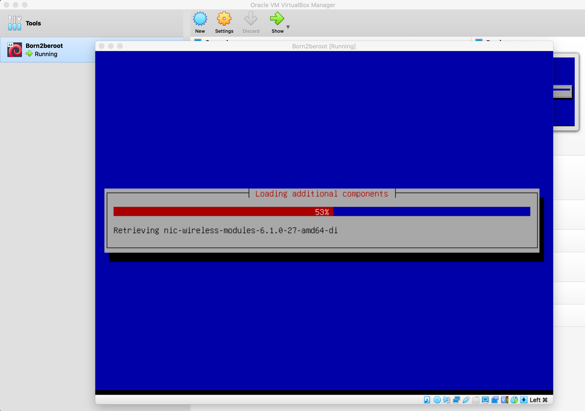
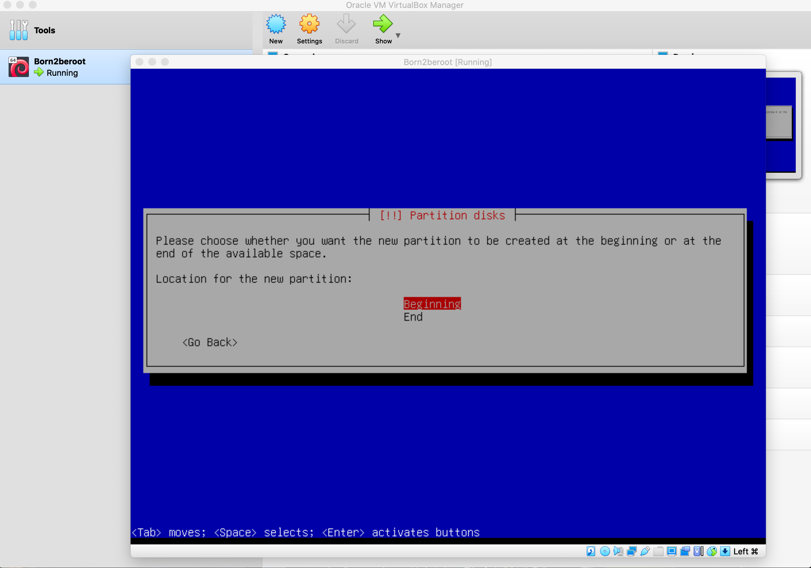

# Born2beroot

## Description
---

**Born2beroot** is your essential companion to mastering Linux system administration, designed to guide beginners and aspiring professionals into the world of root access and system management. This resource simplifies the complexities of Linux, offering clear, practical steps to help users build confidence and expertise.

From foundational concepts like file systems, permissions, and processes to advanced topics such as security, networking, and automation, Born to be Root equips you with the tools and knowledge to excel in system administration. Its hands-on tutorials and real-world examples provide a solid framework for tackling diverse challenges, ensuring you gain both understanding and practical skills.

By adopting the mindset of the root user — the ultimate superuser — you’re encouraged to explore, experiment, and take full control of your Linux environment. This guide empowers you to unlock the system’s full potential, transforming you into a confident and capable administrator.

Whether setting up servers, troubleshooting, or optimizing performance, **Born2beroot** is your trusted guide to navigating the dynamic world of Linux with ease and proficiency.

*For more check the [subject](subject.pdf)*

`Before starting, it's important to understand that each action in every step serves a specific purpose. You should know why it's being done and how it contributes to the overall process. A solid grasp of the technical context is crucial to fully comprehend the procedure.`

## Step 1: Check for VirtualBox
---

To get started, ensure you have **VirtualBox** installed. If not, you can download it from [this link](https://www.virtualbox.org/). **VirtualBox** is essential for setting up the operating system we’ll be working with.

At 1337, **VirtualBox** is already available on the macOS devices, so you likely won’t need to install it. Double-check whether it’s already installed on your machine before proceeding.

### Some things you need to learn

- **VirtualBox**: Understand what VirtualBox is and how it works as a virtualization tool.
- **Virtualization**: Learn the concept of virtualization and its role in creating virtual environments.
- **Operating Systems**: Familiarize yourself with what operating systems are and their importance in managing computer hardware and software.
- **Hypervisor**: Discover the role of a hypervisor and how it enables virtualization by managing virtual machines.

## Step 2: Selecting the Operating System
---

### Debian vs Rocky Linux

When considering the operating system for the "**Born2beroot**" project, **Debian** stands out as the top recommendation. Here’s why:

1. **Stability and Reliability**: Debian is renowned for its robust stability, making it an ideal choice for server environments. With its established release cycle and thorough documentation, it offers a smooth experience for both beginners and advanced users alike.

2. **Extensive Community Support**: Debian is supported by a vibrant and engaged community, with a wealth of online resources to assist you. This active support network is especially valuable if you’re just starting out in system administration.

3. **Ideal for System Administration**: As specifically recommended for newcomers to system administration, Debian’s user-friendly package management (apt) and comprehensive documentation simplify the learning process. It’s a great choice for implementing essential tasks required by the project.

4. **Robust Security**: Debian comes with solid security features, including SELinux, which should be enabled at startup and configured as per the project requirements. AppArmor is also necessary to run at startup, adding another layer of security to the system.

5. **Project Compatibility**: Debian’s capabilities align perfectly with the project’s needs. From setting up encrypted partitions with LVM to implementing a strict password policy, configuring sudo, managing SSH access, and setting up a firewall with UFW, Debian supports all these requirements.

6. **Bonus Features**: Should you opt for the bonus section of the project, Debian provides a stable environment for additional services, like setting up WordPress or any custom service you prefer.

7. **Current Version**: The most recent stable version of Debian, as of this guide’s writing, is Debian 12.5. You can download the image from [this link](https://www.debian.org/download).

In conclusion, Debian offers a dependable, secure, and well-documented platform that fits perfectly with the project’s needs. It’s an excellent choice for gaining hands-on experience in system administration while ensuring your environment is well-supported and aligned with the project’s goals.

## Step 3: Creating a New Virtual Machine in Oracle VirtualBox
---

1. Launch Oracle **VirtualBox**.

2. Select the "**New**" button at the top of the window.


3.  In the name field, enter **'Born2beroot'** and change the version to **Debian (64-bit)**. Also, make sure to select the machine folder path as `Goinfre/home` if you are working on a computer of the school.


4. After pressing **continue** button, the **memory size** should automatically be set to **1024 MB** (1 GB), which is recommended. If it doesn’t appear as **1024 MB**, manually adjust it to that value.


5. After pressing **continue** button, When prompted with three options, select the second one: **Create a virtual hard disk now**.
   

6. After pressing **continue** button, In the **Hard disk file type** options, choose the first option: **VDI (VirtualBox Disk Image)**.
   

7. After pressing **continue** button, In the **Storage on physical hard disk** options, choose the first option: **Dynamically allocated**.
   

8.  After pressing **continue** button, set the size of the virtual hard disk to **30.80 GB** if you're going to work on the **bonus part** of the project. If you're only going to complete the **mandatory part**, choose **8 GB**. If you choose the **mandatory** option, you won't need the extra steps required for the **bonus part** later on. Since you're focusing on the **bonus**, you'll proceed with the 30.80 GB size.


9.  After pressing **continue** or **finished** button, you should see your new **Virtual Machine** created. To move on to the next step, go to **Settings** to start mounting an **ISO file**.


10. In **Settings**, click on the **Storage** tab, then select the **Empty** option under **Storage Devices**.


## Step 4: Mount the ISO File and Start the Virtual Machine
---

1. Once you’ve clicked on **Empty**, you should see a small disk icon similar to the one in the **screenshot below** next to the **optical drive**. Click on it.


2. Choose **debian-12.8.0-amd64-netinst.iso** from the list if it appears. If it doesn't show up, click on the **Choose a disk file** button and select the **debian-12.8.0-amd64-netinst.iso** file from the folder where you downloaded **Debian**.


3. Now, start the machine by clicking the **Start** button, so you can continue with the next step to install **Debian**.


## Step 5: Installing Debian Operating System

### Configuring the Language, Time Zone, and Keyboard Layout

1. The screen will appear as shown below. For a better viewing experience, right-click with your mouse, select the **Virtual Screen 1** option, and scale it to **200%**. After that, choose the **Install** option, as we will proceed without using a graphical interface.


2. Next, you’ll be prompted to select a language. I’m choosing English.


3. Enter your Country, Territory, or Area. Since I’m in Morocco 🇲🇦 I’ll select Other.


4. Choose your continent or region. In my case, it's Morocco 🇲🇦. I will start by selecting Africa.


5. Choose your Country, Territory, or Area. Since I’m Moroccan, I’ll select Morocco 🇲🇦.


6. For configuring locales, I’ll choose United States.


7. In keyboard configuration, Select American English to ensure the keys are correctly mapped; otherwise, the keyboard layout may not function as expected.


8. Once this steps is completed, you should see a window similar to the one below.


### Configuring the Network

1. The system will first ask for the **hostname**. As per the instructions, you should enter your **intra name** followed by **42**. In my case, it’s **noaziki42**.


2. For domain name, We'll leave this section blank, as the instructions do not specify any requirements for a domain name.


3. You’ll be prompted to enter a password for the system administrator account. It's important to write it down or take a photo for reference, as you will need it later. If you want to confirm that you've entered the password correctly, tab until you reach the **Show Password in Clear** option. Press the space bar, and the password will be displayed.


4. Now, you'll be asked to re-enter the password to confirm it. Make sure it matches the one you entered previously.


5. To avoid using the root account for non-administrative tasks, you'll be prompted to create a normal user account. I’ll enter my full name, **Nouhaila Aziki**, as the full name for the new user.


6. Now, you’ll be asked to provide a nickname or username for the non-root user. I’ll proceed with my intra username, **noaziki**, as the username for the new user.


7. You’ll need to choose a password for the non-root user. I’m proceeding with a new one, but if you think you might forget it, it's better to use the same password as the one for the Root User 😊.


8. You’ll need to confirm the password for the non-root user. As I showed when setting the root password, you can use the arrows to navigate to the **Show Password** option and press the space bar to display it, ensuring it’s correct.


### Setting Up the Partitions

Partitioning is crucial for organizing disk space on your server. It divides the disk into separate sections, each serving a specific purpose.

1. **Use Entire Disk and Set Up Encrypted LVM**: This option selects guided partitioning, which will automatically partition the disk and set up encrypted Logical Volume Manager (LVM). This option is required since the project specifies the use of encrypted partitions.

**BUT... ⚠️❗️** If you're aiming to complete the **bonus part** of the project, you'll need to click Manual and proceed with custom partitioning. This part is a reminder for those who want to do the bonus work. If you want to follow the default process, you can skip this step and continue with the guided option.

I will proceed with what’s required for the bonus part, but you can choose to skip it and go straight to the guided partitioning.


2. In this section, you’ll see a general description of your partitions and mount points. Since we haven’t created any partitions yet, we need to create a  new partition table. To do this, choose the device where you want to create the partitions. In my case, I’ll select the only available device: SCSI2 (0, 0, 0) (sda) - 33.1 GB ATA VBOX HARDDISK.

Don’t be confused if you see SCSI3 instead, as the SCSI controller number is assigned automatically by VirtualBox and may vary between installations or configurations. This number is just a virtual representation of the disk controller used by the virtual machine. As long as you choose the correct disk (sda) with the correct capacity (33.1 GB ATA VBOX HARDDISK), you should be good to go.


3. Click **Yes** to confirm the device selection.


4. After completing the previous step, you’ll see an empty partition table. To configure it, select the **FREE SPACE** in order to create the partitions.


5. Create a new partition.


6. Following the image provided in the subject, we will create the partitions one by one (this image from the bonus part).


7. As indicated in the subject, the size of the first partition should be **500.99 megabytes**.


8. I will briefly explain the different types of sections:

`Primary Partition: This is the only type of partition that can hold an operating system. A hard drive can have up to four primary partitions, or three primary partitions and one extended partition.`

`Extended Partition: Designed to overcome the limit of four primary partitions on a single disk, only one extended partition can exist per disk. It serves as a container for logical partitions.`

`Logical Partition: This partition exists within an extended partition and is formatted with a specific file system, like ext4. Once formatted, it is recognized by the operating system as a separate drive. While you can have up to 23 logical partitions in theory, Linux limits this to 15 logical partitions for practical use, which is more than enough for the scope of this project.`

For this step, we will choose Primary because it will be the partition where the Operating System will be installed.


9. We will select **Beginning** because we want the new partition to be created at the start of the available space on the disk.


10. The following screenshot displays the partition details. We will modify the mount point according to the specifications provided in the project instructions.


11. We will choose **/boot** as the mount point for our partition, as specified in the project instructions.


12. We have finished configuring the current partition.


13. Once we have completed the previous step, the partition should appear. Next, we need to create a logical partition using all the remaining available disk space. This partition will have no mount point and will be encrypted. To do this, we select the free space where we want to create the logical partition.

14. Create a new partition


15. We will follow the example provided in the subject for creating the logical partition.


16. We will select max for this partition to utilize all the remaining available disk space.


17. Since we need to create the LVM, we must select Logical for this partition type.


18. For this partition, we will not assign a mount point, as it is meant to be encrypted and used for LVM (Logical Volume Management).


19. In the context of virtual machines (VMs) and disk management, logical partitions are typically not mounted directly because they are part of a larger virtual disk image or disk file. Instead, they are used as components of LVM (Logical Volume Management), where they are combined into logical volumes that are then mounted for use by the system.


20. Now that we have selected Logical for the partition type and left it without a mount point, we can finish the partitioning process by confirming and applying the changes. Once done, the logical partition will be created, and we'll proceed to the next steps in the setup process.


21. Let's configure the encrypted volumes now


22. Accept the confirmation message to proceed with configuring the encrypted volume. This step finalizes the encryption setup and applies the necessary changes to the partition.


 23. Waiting for upload.


 24. Now, we proceed to create the encrypted volumes. This step involves setting up the partition for encryption to ensure data security.


25. We select the partition we want to encrypt. Use the arrow keys to navigate to /dev/sda5, and press the space bar to select it.


26. We have completed the configuration of the current partition and can now proceed to the next step.


27. We are done with this step, as we do not need to create any additional encrypted volumes.


28. We accept the confirmation message, which informs us that everything within the selected partition will be encrypted. The process should complete quickly.


29. We don't mind whether it takes a long time or a short time; we simply click 'Cancel' because there is nothing to encrypt, as the partition is empty.


30. Once again, we will need to enter a password, but this time it will be the encryption phrase. As I mentioned earlier, you must repeat the process and write it down, as it will be important in the future.


31. Confirm the password.


32. Now we'll configure the Logical Volume Manager.


33. We will accept the confirmation message, as we agree that the changes will be saved to the disk.


34. Let's create a new volume group. A volume group combines multiple partitions.


35. We need to assign the name as specified in the instructions: LVMGroup.


36. Select the partition where the group should be created.


37. We need to create them according to the example provided in the instructions.


38. We'll begin by selecting the group where we want them to be created. Choose the only available group (the one we just created).


39. We'll follow the sequence outlined in the subject for creating the logical volume, beginning with the root and finishing with var-log. After that, we’ll choose a name for each logical volume accordingly.


40. As specified in the subject, the size will be set to 10GB.


41. To avoid repetition, proceed by applying the same process to all partitions in the volume group. Assign each one the same name and size as outlined in the example above.


42. Once you’ve created all the logical volumes as specified, your window should match the one shown below. At this point, simply type `"finish"` to complete the process.


43. Now, in the section displaying all the partitions and available free space, you should see all the logical partitions we just created. Our next step is to configure each one by selecting the desired file system and the corresponding mount point as specified in the subject. We’ll proceed in order, starting with the first partition that appears, which is "home," by pressing Enter.

   
44. It will display the partition configuration. Since the partition currently lacks a file system, we need to assign one. To do this, press Enter on the `"Use as"` option, which is currently set to `"Do not use."`


45. Select the Ext4 file system, as it is the most commonly used file system in Linux distributions.


46. Next, we need to select the mount point by pressing Enter on the "Mount point" option.


47. For the "home" partition, select "home" as the mount point. For future partitions, choose the appropriate mount points specific to each one to avoid repetition.


48. The partition setup is complete.


49. Now, proceed with the same steps for all the partitions. For the var/log partition, manually enter the mount point. For the swap partition, instead of choosing a file system, select "swap area" after you click `"Use as: Do not use."`, Once all the partitions are configured, click "Finish partitioning" and confirm to write the changes to the disk.


50. Confirm the changes, and after that, you will see the installation progress bar.


51. It will prompt us to install additional packages. However, select "No" since they are not needed for this setup.


52. Choose the country that is specific to your location. This will set the appropriate time zone and regional settings for your system.


53. Choosing `deb.debian.org` ensures faster, reliable, and secure package downloads by automatically selecting the best mirror based on your location.


54. Leave this field empty and press `continue`


55. Since we do not want developers to see our statistics, select `"No"`


56. Remove all software options by pressing the space bar and then click "Continue," as these options are forbidden according to the subject.


57. Select "Yes" to install the GRUB bootloader on the hard drive. GRUB is essential in the boot process of Linux-based operating systems, providing a flexible and customizable bootloader that manages system booting, kernel loading, and system recovery.


58. Next, choose the device for the bootloader installation. Select /dev/sda (ata_VBOX_HARDDISK) as the target for the GRUB bootloader. This ensures that your system will boot from the correct hard drive.


59. Type `"Continue"` to complete the installation and finish setting up your system.


## Step 6: Virtual Machine Configuration
---

1. The first step is to enter the encryption password that you previously set up during the installation process. This will unlock the encrypted disk and allow the system to boot successfully.


2. Next, enter the username and password for the non-root user that you created during the installation process. This will log you into the system with regular user privileges.

Great! 🎉 Now that everything is set up, you're ready to begin configuring your Debian virtual machine. You can now proceed with installing any necessary software, setting up your development environment, or customizing the system to suit your needs. Enjoy exploring your virtual machine!

## Step 7: Install sudo and configure users and groups
---

1. To install **sudo**, we first need to switch to the root user. Open the terminal, type `su`, and enter the root password when prompted. Once logged in as root, run the command `apt install sudo` to install the required package. After installation, restart the machine to apply the changes. Use the command `sudo reboot` to reboot the system and wait for it to restart.


2. After rebooting, re-enter the encryption and user passwords. To ensure sudo was installed correctly, log in as the root user again and run the command `sudo -V`, this will show the sudo version, along with the configuration arguments and available plugins that provide additional details. Next, switch to the root user using `su -`. Then, attempt to create a user with the same name as the non-root user currently logged in `sudo adduser your_login`. Since the user was already created during the installation, you should receive a message indicating that the user already exists.


 3. Next, we need to create a new group called user42. To do this, run the following command `sudo addgroup user42`, this will add the new group to the system.


4. ```🤔 Have you heard of **GID**? It stands for **Group Identifier**—essentially the unique ID assigned to each group in Unix-like systems. Similar to how users are given a **UID** (User ID), groups are identified by their **GID**. This identifier is key for managing permissions and access control, allowing users in the same group to collaborate and share resources seamlessly. Think of the **GID** as the group’s digital signature, ensuring efficient organization and coordination within the system.```

🤔 Was the group created successfully? Yes, since no error message appeared, the group has been created properly. To confirm, you can use the command `getent group group_name`.

Running the command `cat /etc/group` will display the contents of the **/etc/group** file, which includes a list of all groups on your system, along with their **GID** and members. The output will look something like this:


5. To add a user to a group, you can use the command `sudo adduser username group_name`, this command will include the user in the specified group. In this case, we need to add the user to both the sudo and user42 groups. To do this, run `sudo adduser username sudo` and `sudo adduser username user42`. After adding the user to the groups, you can verify that everything is set up correctly by using the command `getent group group_name`. Alternatively, you can open and edit the `/etc/group` file using `sudo vim /etc/group`. In this file, you should see the username listed under both the sudo and user42 groups. This confirms that the user is correctly added to the groups.


## Step 8: Install and configure the SSH
---

```🔒 **SSH**, or **Secure Shell**, serves as both a protocol and a tool for securely accessing remote servers. It establishes an encrypted communication channel, ensuring that all data exchanged between the client and the server remains confidential and intact. This strong encryption makes SSH indispensable for secure remote management and file transfers.```

1. The first thing, we’ll install the primary connectivity tool for remote login using the SSH protocol: OpenSSH. To install it, we’ll enter the following command `sudo apt install openssh-server`. When prompted with a confirmation message, type Y to proceed, and then wait for the installation to complete.

After running the installation command, you should see an output similar to the following:

To verify that OpenSSH has been installed correctly, we’ll run the following command `sudo service ssh status`. If the installation was successful, you should see an output indicating that the SSH service is active and running, similar to this:

This confirms that SSH is up and running.

2. After completing the installation, there are configuration files that we need to adjust. For this, we’ll use vim(to install vim use the command `apt install vim`), or any other preferred text editor. The first file to modify is located at `/etc/ssh/sshd_config`. If you're not logged in as the root user, you might not have the necessary write permissions. In such cases, you can either. Switch to the root user by running `su -`, followed by entering the root password. Or, simply prepend sudo to the command to temporarily gain root privileges, like this `sudo vim /etc/ssh/sshd_config`. This allows you to edit the configuration file with the proper permissions.

The following image illustrates the vim installation stage.

This command below is to open /etc/ssh/sshd_config

You have to see as in the picture


In the SSH configuration file (/etc/ssh/sshd_config), lines that begin with a # are commented out, meaning they are inactive. To modify these lines, we will need to remove the comment (the #) and then update the values. Once you're editing the file, locate the following lines and modify them as shown. Change the port number:
`#Port 22`
Remove the # and change the port to 4242, so the line should look like this:
`Port 4242`
Disable root login:
`#PermitRootLogin prohibit-password`
Remove the # and set root login to no:
`PermitRootLogin no`
After making these changes, save the file and exit the editor with `ESC` and `:wq!` .


3. Next, we need to edit the file located at: `/etc/ssh/ssh_config`

Uncoment the Port 22 and change it to 4242


4. Finally, to apply the changes we’ve made, we need to restart the SSH service. To do this, run the following command: `sudo service ssh restart`. Once the service has been restarted, you can check its status to confirm that the changes have been applied correctly. Use the following command: `sudo service ssh status`. Look for the Port 4242 line in the output to verify that the server is now listening on the new port. It should look similar to this:

This confirms that SSH is now operating on Port 4242 as intended.

## Step 9: Install and configure the UFW
---


🔒 **UFW** (Uncomplicated Firewall) is a user-friendly front-end for managing **iptables**, the default firewall configuration tool used by many Linux distributions. It simplifies the process of configuring firewall rules through an intuitive command-line interface. This makes it easy for users to control network traffic and strengthen system security with just a few commands.

With UFW, even users with limited experience in firewall management can quickly set up and maintain strong firewall policies, protecting their systems from unauthorized access and potential threats.
